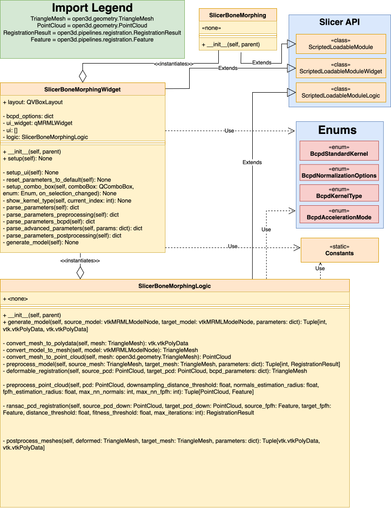

# SlicerBoneMorphing
<!-- TODO: Explain in more depth -->
Extension for 3D Slicer for bone mesh morphing.

At the moment, this module specializes for the *humerus* bone, but the use case is not limited to it. 

## Special thanks 
Special thanks goes to my wonderful colleagues Eva C. Herbst (@evaherbst) and Arthur Porto (@agporto) for creating the initial idea and their huge help during the development of this module! 
Also, I would like to thank O. Hirose (@ohirose) for the research on BCPD/GBCPD and it's implementation (can be found [here](https://github.com/ohirose/bcpd))

## Installation
**Supported platforms:**
- Linux (x86_64)
- Windows (x86_64)
- MacOS (both x86_64 and ARM; Slicer runs through Rosetta on ARM-based Macs)

Steps:
- Download the latest ZIP package from Releases
- Extract the ZIP contents to your desired folder
- Open up 3D Slicer, go to Edit -> Application Settings
- In the modules section, add the extracted contents' path to "Additional Module Paths" 
- Restart 3D Slicer

> **DISCLAIMER! After restarting, the installation process will begin. If there are any Python modules not available in Slicer, they will be installed, so the startup will take SIGNIFICANTLY MORE amount of time. Do not be scared, this is intended behaviour.**

## Usage
After a successful install, the module will be available in the **Morphing** section. 
When switching to the module, you should be greeted with the following UI: 

 

The UI consists of **4** main sections
- Input
- Preprocessing
- Generation
- Postprocessing

## Architecture

 

## Module sections

### <ins>Input section</ins>
This section is self-explanatory. Here, you choose two input models:
- Source = The mean model, i.e. a full humerus
- Target = Partial model to be reconstructed

### <ins>Preprocessing section</ins>

Before the generation process, we want to preprocess the model.
First of all is the option of downsampling. For this, you can configure the threshold for downsampling by the following parameter:
- **Downsampling distance threshold**
    - If set to 0.0, no downsampling is performed

After the downsampling, we compute the normals of the point cloud. 
The computation needs a radius for which the normals are calculated and maximum number of neighbours. 
These can be adjusted with the following parameters: 
- **Normals estimation radius** - maximum radius in which points are considered neighbouring
- **Normals estimation max neighbours** - maximum number of neighbours taken into account 

Also, we need to calculate a *(Fast) point feature histogram* in order to encode the local geometric properties of the models. 
This method uses the following parameters:
- **FPFH search radius** - maximum radius in which points are considered neighbouring
- **FPFH max neighbours** - maximum number of neighbours taken into account 

#### <ins>Registration</ins>
At this moment we have our models preprocessed and ready for the next step, which is the registration.
Here we calculate the rigid alignment of the models in order to pre-align them.
The concrete method we use is called **RANSAC** (random sample consensus). 
The behaviour of this algorithm can be adjusted by the following parameters: 
- **Max iterations**
- **Distance threshold** - maximum distance in which points are considered neighbouring
- **Fitness threshold** - the lowest fitness between the models to be accepted. 

The computed fit by the RANSAC algorithm is a bit "raw". To improve it further, we perform the **ICP** (Iterative closest points) algorithm.
This can be tuned by the following parameter:
- **ICP Distance threshold** - maximum distance in which points are considered neighbouring

### <ins>Reconstruction section</ins>
Since we now have a preprocessed meshes and with defined transformations from the *source* to the *target*, we can proceed to the **reconstruction section**.
For the reconstruction we use the **BCPD** (Bayesian coherent point drift) algorithm.
Now, the BCPD allows for very fine adjustments of its behaviour using lots of different parameters. 
For the exact description of their effects, please refer to the official documentation [here](https://github.com/ohirose/bcpd/blob/master/README.md).

> **Note: You do NOT have to perform any kind of installation process, the BCPD and its geodesic variant are already pre-built and preconfigured for immediate use in this module.**

**Not implemented options:**
- Terminal output 
- File output

### <ins>Postprocessing section</ins>
After the model is reconstructed, we include a postprocessing section to slightly modify the result, if necessary.
For these, we let you modify the following parameters:
- **Clustering scaling**
    - Scaled size of voxel for within vertices that are clustered together (additionally refer to [here](http://www.open3d.org/docs/0.7.0/python_api/open3d.geometry.simplify_vertex_clustering.html))
    - If set to 1.0, no scaling is performed
- **Smoothing iterations** - Number of iterations of mesh smoothing
    - If set to 0, no smoothing is applied 

After the whole process is done, both the generated mesh (source transformed into target, standalone) and the merged mesh (generated meshes merged with the target; "combined model") are import back into the current Slicer scene.

 

## Contributors
A huge thank you to all of the contributors! 

