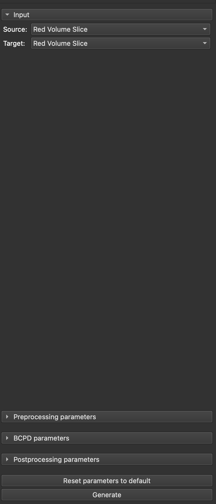
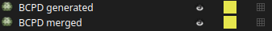

# SlicerBoneMorphing
<!-- TODO: Explain in more depth -->
Extension for 3D Slicer for bone mesh morphing.

At the moment, this module specializes for the *humerus* bone. 

## Installation
- Download the latest ZIP package from Releases
- Extract the ZIP contents to your desired folder
- Open up 3D Slicer, go to Edit -> Application Settings
- In the modules section, add the extracted contents' path to "Additional Module Paths" 
- Restart 3D Slicer

> **DISCLAIMER! After restarting, the installation process will begin. If there are any Python modules not available in Slicer, they will be installed, so the startup will take SIGNIFICANTLY MORE amount of time. Do not be scared, this is intended behaviour.**

## Usage
After a successful install, the module will be available in the **Morphing** section. 
When switching to the module, you should be greeted with the following UI: 

 

The UI consists of **4** main modules
- Input
- Preprocessing
- BCPD
- Postprocessing

## Architecture
<!-- TODO: Create a workflow diagram -->
To be added.

## Module sections

### Input section
This section is self-explanatory. Here, you choose two input models:
- Source = Source for the generation; This is the model that represents the 
- Target = Model which is non-complete => Needs its missing portions generated

### Preprocessing section

#### <ins>Point cloud preprocessing</ins>
Before the generation process, we usually want to preprocess the model.
Reasons could be to remove unwanted **outliers** or to smooth out the models.
First of all, the model is converted to a *point cloud* to be able to effectively perform some preprocessing steps.

Then, a downsampling is performed. For this, you can configure the threshold for downsampling by the following parameter:
- **Downsampling distance threshold**

After the downsampling, we compute the normals of the point cloud. It uses a radius for which the normals are calculated and maximum number of neighbours. This can be adjusted with the following parameter: 
- **Normals estimation radius**
- **Normals estimation max neighbours**

Also, we want calculate a *Fast point feature histogram* to somehow encode the local geometric properties. This method takes in two following parameters:
- **FPFH search radius** - Radius in which the FPFH is calculated in
- **FPFH max neighbours** - Maximum number of neighbours taken into account 

#### <ins>Registration section</ins>
At this moment, we have our point clouds preprocessed and ready for the next step, which is the "registration" section.
Here we try to define and calculate how and how much we need to adjust the source mesh to match the target one. 

For this, we will use the downsampled point clouds with their corresponding FPFHs from the previous step.
The concrete method we use is called **RANSAC**. It uses a process called "repeated random sub-sampling" to mitigate the effect of outliers as much as possible. 
The behaviour of this algorithm can be adjusted by the following parameters: 
- **Max iterations**
- **Distance threshold** - same meaning as in previous steps
- **Fitness threshold** - the lowest fitness between the point clouds to be accepted. The lower, the higher chance of finding a good fit. The higher, higher the chance that either *max iterations* are reached 

The result of the *RANSAC* algorithm is a bit "raw". To get the best possible fit, we perform the **ICP registration algorithm** upon the result.
This can be tuned by the following parameter:
- **ICP Distance threshold** - same meaning as in previous steps

### Generation section
Since we now have a preprocessed meshes and with defined transformations from the *source* to the *target*, we can proceed to the **generation section**.

For this purpose, we use a method called [Bayesian coherent point drift](https://github.com/ohirose/bcpd). It falls into the *non-rigid registration* category of algorithms, which is exactly what we need. 
It takes in both meshes and deforms the source into the target, similarly as we've already done in the [Registration section](#preprocessing-section).
Due to the problem that BCPD allows for "unrealistic" deformations, we have already "premerged" the meshes together to mitigate this behaviour -> hence this is more of a optimization steps.

Now, BCPD allows for very fine adjustments of its behaviours using lots of different parameters. For exact description of their effects, please refer to the documentation [here](https://github.com/ohirose/bcpd/blob/master/README.md).

> **Note: You do NOT have to perform any kind of installation process, the BCPD and its geodesic variant are already pre-built and preconfigured for immediate using in this module.**

**Not implemented options:**
- Terminal output 
- File output

### Postprocessing section
After our models have been merged successfully, we still want to apply a slight amount of postprocessing to reach the most optimal results. 
We are basically using a bit of **filtering and smoothing** to the meshes. 
For these, we let you modify the following parameters:
- **Clustering scaling** - Scaled size of voxel for within vertices that are clustered together (additionally refer to [here](http://www.open3d.org/docs/0.7.0/python_api/open3d.geometry.simplify_vertex_clustering.html)
- **Smoothing iterations** - Number of iterations of mesh smoothing

After the whole process is done, both the generated mesh (source transformed into target, standalone) and the merged mesh (generated meshes merged with the target; "combined model") are import back into the current Slicer scene.

 

## FAQ 
To be added.

## Troubleshooting
To be added. 

